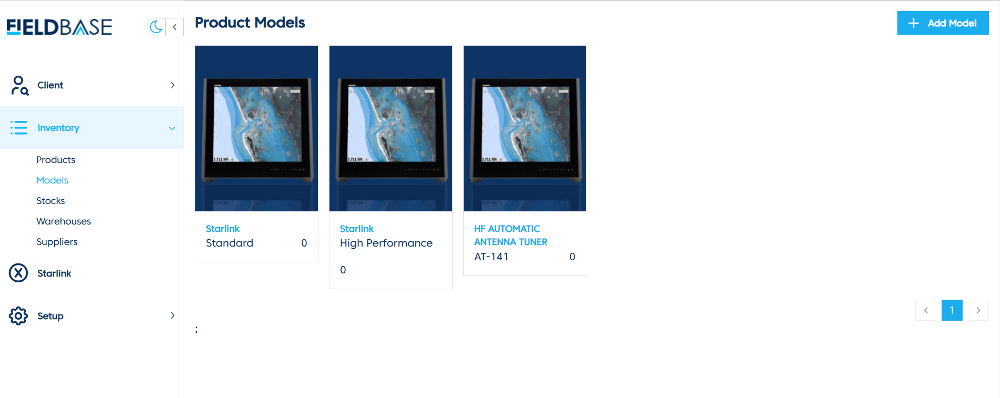
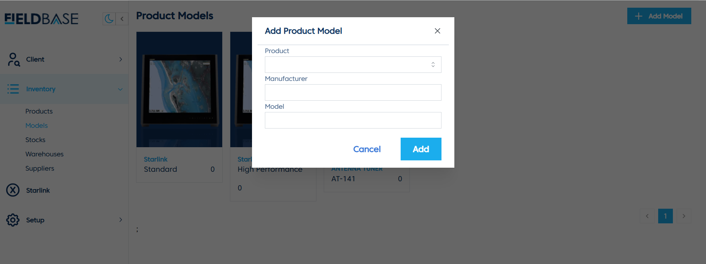
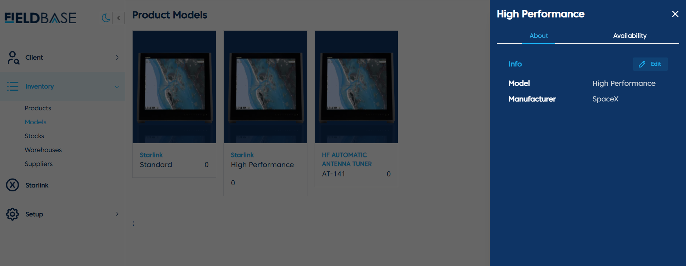

# Create and Update Models

## Overview

The **Models Page** is used to manage product models, including adding new models and viewing model details.

## Features
- **View Models**: Displays a list of product models along with manufacturer details.
- **Add Product Model**:

  1. Click **Add Model**.
  2. Select the **Product**.
  3. Enter **Manufacturer** and **Model**.
  4. Click **Add** to save the model.
- **Edit Model**:

  1. Click **Edit** next to a model.
  2. Modify the necessary details.
  3. Save the changes.
