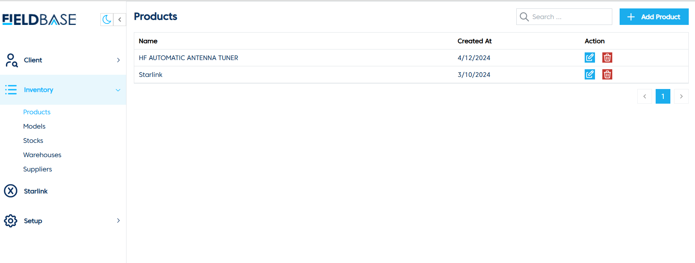
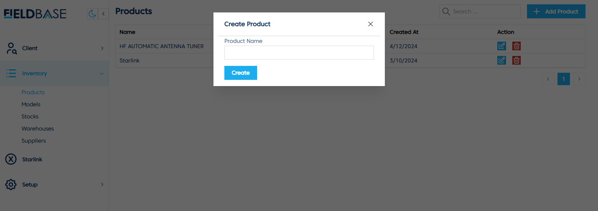

# Create and Update Products

## Overview

The **Products Page** allows users to manage product information, including adding new products and viewing existing ones.

## Features
- **View Products**: Displays a list of products, including their name and creation date.
- **Add Product**:

  1. Click on **Add Product**.
  2. Enter the **Product Name**.
  3. Click **Create** to save the new product.
