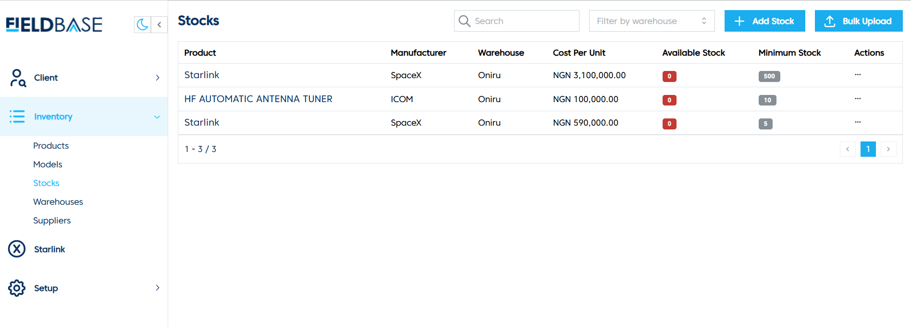
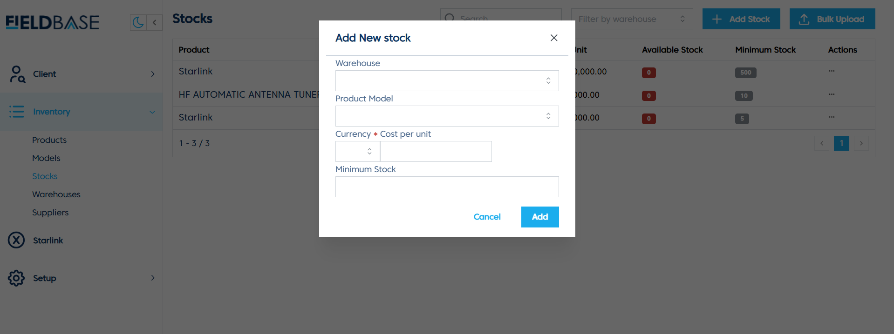
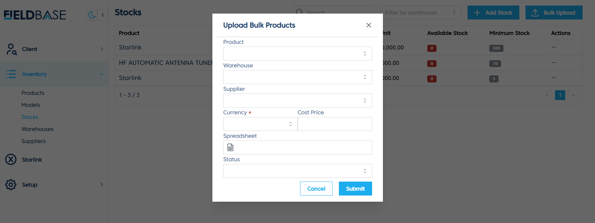

# Create and Update Stocks

## Overview

The **Stocks Page** allows users to manage product stock levels, track available stock, and add new stock items.

## Features
- **View Stock**: Displays stock details, including product, manufacturer, warehouse, cost per unit, available stock, and minimum stock levels.
- **Add Stock**:

  1. Click **Add Stock**.
  2. Select **Warehouse**.
  3. Choose the **Product Model**.
  4. Enter **Currency**, **Cost Per Unit**, and **Minimum Stock**.
  5. Click **Add** to save.
- **Bulk Upload**:

  1. Click **Upload Bulk Products**.
  2. Select a **Spreadsheet** file.
  3. Fill in necessary fields (Product, Warehouse, Supplier, Currency, Cost Price).
  4. Click **Submit** to upload.
