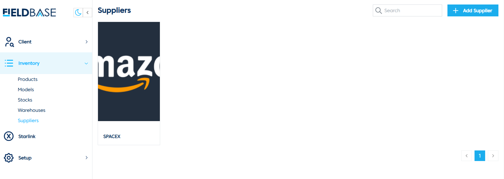
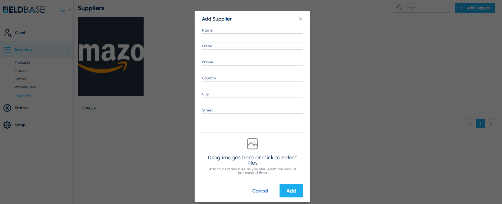

# Suppliers

## Overview

The **Suppliers Page** is used to manage supplier details.

## Features
- **View Suppliers**: Displays a list of suppliers and their details.
- **Add Supplier**:

  1. Click **Add Supplier**.
  2. Enter the **Name**, **Email**, **Phone**, **Country**, **City**, and **Street**.
  3. Drag and drop images or click to upload.
  4. Click **Add** to save the supplier.
