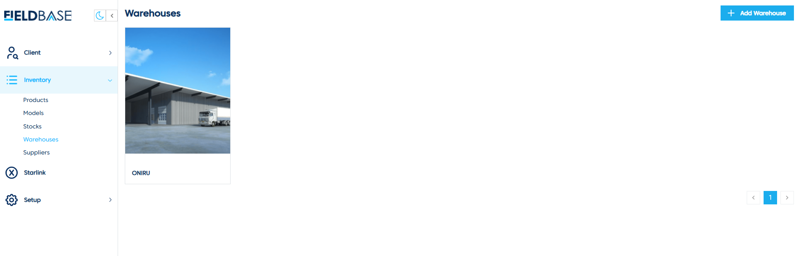
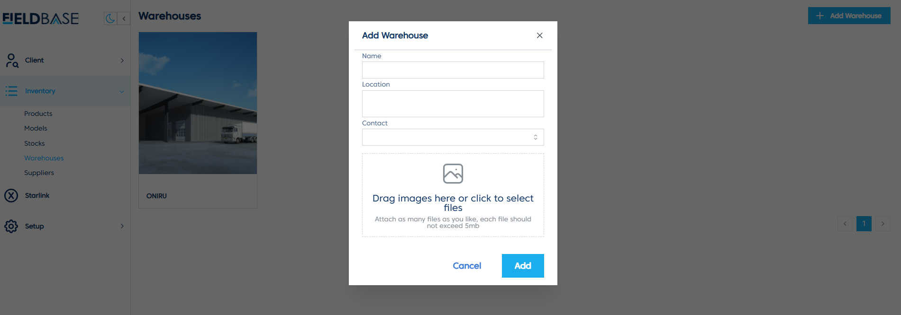

# Warehouses

## Overview

The **Warehouses Page** manages storage locations for inventory.

## Features
- **View Warehouses**: Displays a list of warehouses with their names and IDs.
- **Add Warehouse**:

  1. Click **Add Warehouse**.
  2. Enter **Name**, **Location**, and **Contact Details**.
  3. Drag and drop images or click to upload.
  4. Click **Add** to save.
