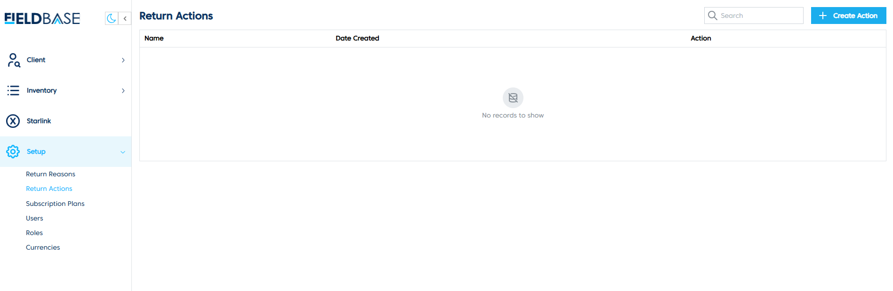
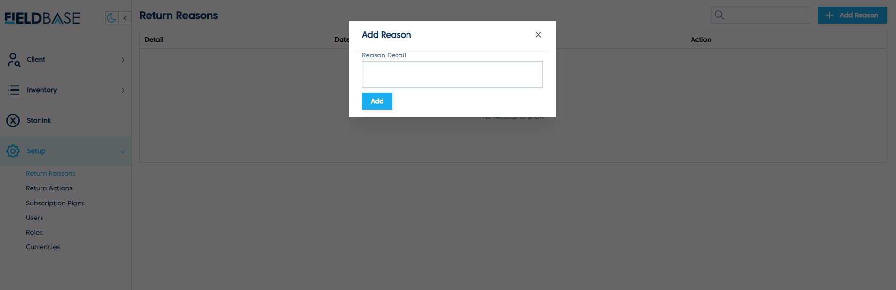

# Set Up Return Reasons

## Overview

The **Return Reasons Page** allows users to manage reasons for returned items, ensuring proper tracking and categorization.

## Features
- **View Return Reasons**: Displays a list of existing return reasons.
- **Add Return Reason**:

  1. Click on **Add Reason**.
  2. Enter the **Reason Detail**.
  3. Click **Add** to save the reason.
