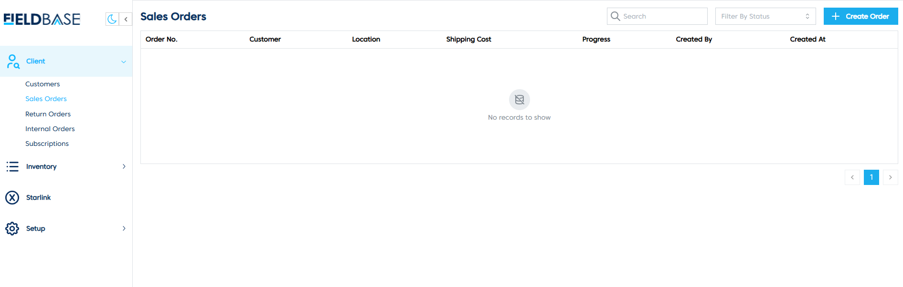
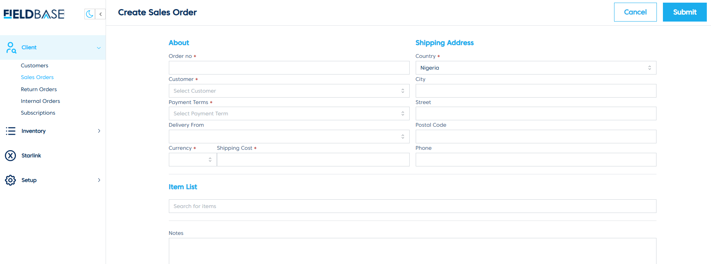

# Manage Sales Orders

## Overview

The **Sales Orders Page** is used to create and manage sales orders for customers.

## Features
- **View Sales Orders**: Displays order details such as order number, customer, location, shipping cost, progress, creator, and creation date.
- **Create Sales Order**:

  1. Click on **Create Order**.
  2. Fill in the required details:
     - Order Number
     - Customer
     - Payment Terms
     - Delivery From
     - Currency
     - Shipping Cost
     - Shipping Address (Country, City, Street, Postal Code, Phone)
     - Item List
     - Notes
  3. Click **Submit** to create the order.
