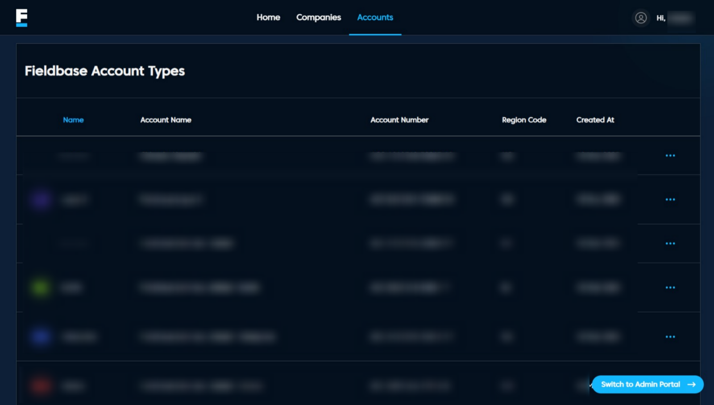

# Accounts Page

## Overview
The **Fieldbase Account Types** page provides an organized view of all registered accounts, including their names, IDs, region codes, and creation dates. It helps users quickly monitor and manage account information.
## Features
- **Accounts Table:** Lists all Fieldbase accounts with details such as Name, Account Name, Account Number, Region Code, and Created At. 
- **Actions Menu (⋯):** Provides quick operations, including **edit & delete** to access linked device details.  
- **Search & Sort:** Quickly find or organize accounts by any column.  
- **Switch to Admin Portal:** Redirects to the Admin Portal for broader management controls.

## Navigation
- **Home:** Returns to the dashboard overview.  
- **Companies:** Displays registered client companies and contacts.  
- **Accounts:** Opens the current Account Types view.  
- **Switch to Admin Portal:** Located at the bottom-right for quick admin access.