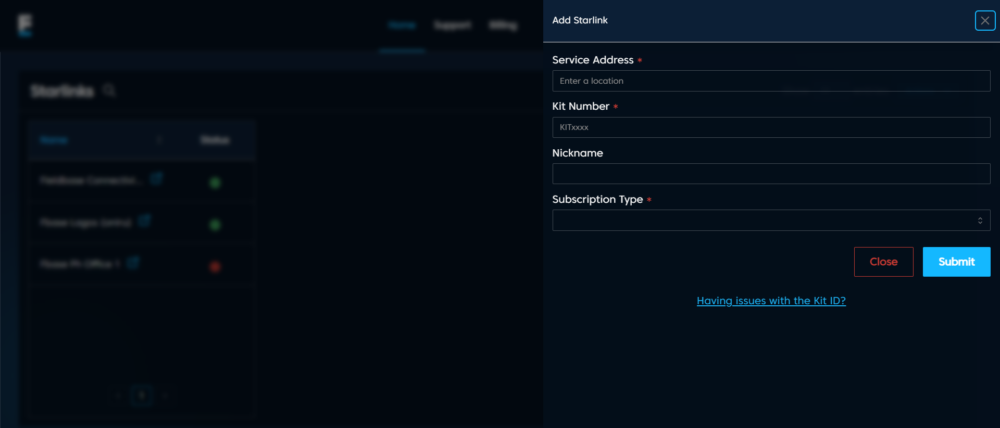

# Add Starlink Pop-up Page

## Overview

The **Add Starlink** form allows users to register a new Starlink kit by entering the required details.

---

## Fields

- **Service Address** (Required): Enter the physical location where the Starlink service will be used.  
- **Kit Number** (Required): The unique identifier of the Starlink kit, usually beginning with `KIT`.  
- **Nickname** (Optional): A user-defined label for easier identification.  
- **Subscription Type** (Required): Select the appropriate subscription plan (e.g., Residential, Business, Maritime).  

---

## Actions

- **Submit**: Validates the inputs and registers the kit. On success, the form closes and the new kit is added to the list. On failure, an error message is displayed.  
- **Close**: Cancels the operation and closes the form without saving changes.  
- **Having issues with the Kit ID?**: Opens a help link for troubleshooting problems related to Kit IDs.  

---
