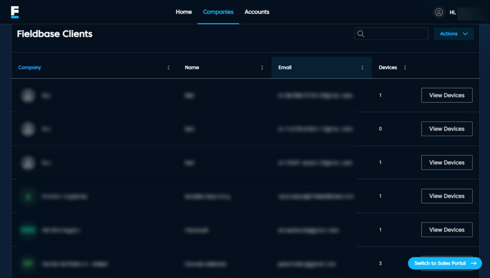

# Companies Page

## Overview
The Companies Page provides a list of registered companies, allowing users to view associated devices, download CSV data, and add Starlink services.

## Features
- **Fieldbase Clients Table:** Displays company names, emails, and access to view their devices.
- **Download CSV:** Exports the list of companies in a CSV format.
- **Add Starlink:** Opens a pop-up to add new Starlink services.
- **Pagination Controls:** Navigate between multiple pages of company records.
- **View Sales Portal:** Redirects to the sales portal.

## Navigation
1. **View Devices:** Clicking this button next to a company name directs users to the View Devices Page.
2. **Add Starlink:** Opens a pop-up form for adding Starlink services.
3. **Pagination:** Use the navigation buttons to move through the list of companies.
