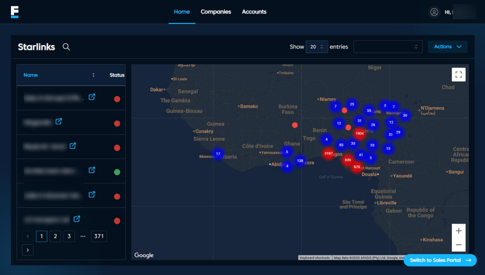

# Home Page

## Overview
The Home Page provides an overview of Starlink services and their statuses.

## Features
- **Starlinks Table**: Displays the name and status of each device.  
- **Status Indicators**: Green for online devices, red for offline.  
- **Interactive Map**: Visualizes device locations with zoom and fullscreen options.  
- **Pagination**: Navigate through multiple device entries.  
- **Actions Menu**: Provides quick options for managing Starlink records.  
- **Search Bar**: Allows filtering of devices by name.  

---

## Navigation
- **Home** → Returns to the device overview page.  
- **Accounts** →
- **Companies** → Redirects to billing details and payment history. 