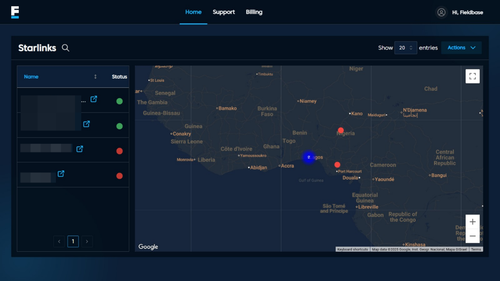

# Home Page

## Overview
The Home Page provides an overview of all connected Starlink devices under your account.  
It displays each device’s live connection status and its geographical location on an interactive map for easy monitoring and management.

### Features
- **Starlinks Table:**  Displays Starlink names, service line numbers, and current statuses.
- **Geo Mapping:** Interactive map powered by Google Maps API showing exact terminal positions. 
- **Search & Filter:** Quickly locate specific devices by name, region, or connection state.
- **Actions Menu:** Access options like refresh, export logs, or open detailed terminal view.

### Navigation
- Clicking **Search Bar:** Instantly locate specific Starlink devices.
- Clicking **Support** Redirects to the Support Page where users can submit issues, track tickets, and communicate with support.
- Clicking the **Map Controls:** Zoom in/out to reposition the map for a better view.
