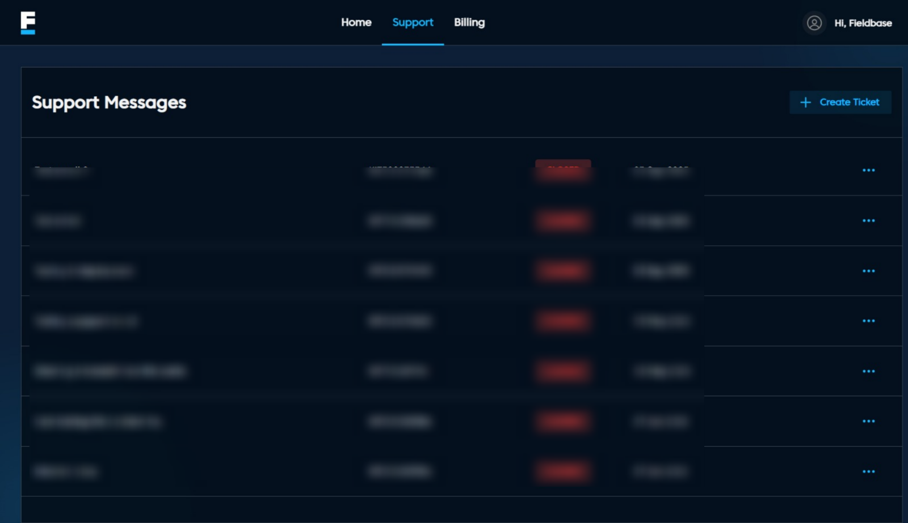

# Support Page

## Overview
The Support Page allows users to manage all support-related activities in one place. It provides access to existing support tickets, their statuses, creation dates, and quick actions for viewing or reopening tickets.

### Features
- **Support Messages:** Displays a list of past support interactions.
- **Ticket History:** Lists previous support tickets with details including:
     - Ticket description
     - Assigned Kit Number
     - Status (open/closed)
     - Date and time of creation
     - Option to View Details of each ticket.
- **Create Ticket:** Allows users to create a new support request.

### Navigation
- Clicking **View Details** on a ticket opens the full conversation and resolution status.
- Clicking **Create Ticket** allows users to submit a new support request.
- Clicking **Re-Open Ticket** allows users to submit a new support request.
