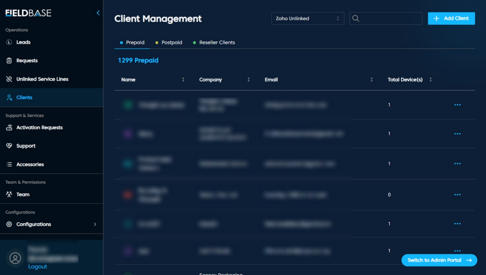

# Client Management

## Purpose 

Manage existing customer records with relevant details.

## Table Columns

| Field             | Description                        |
|-------------------|------------------------------------|
| Name              | Client or company representative   |
| Company           | Client's company name              |
| Email             | Client's email                     |
| Total Device(s)   | Number of registered devices       |

**Features** 
1. Client Table to Display all client records.
2. Tabs to Separate clients by billing type
3. Search to Filter and Quickly locate clients
4. Add Client Register new customers
5. View and edit client profiles

**Actions**
- View Details
- Close Ticket