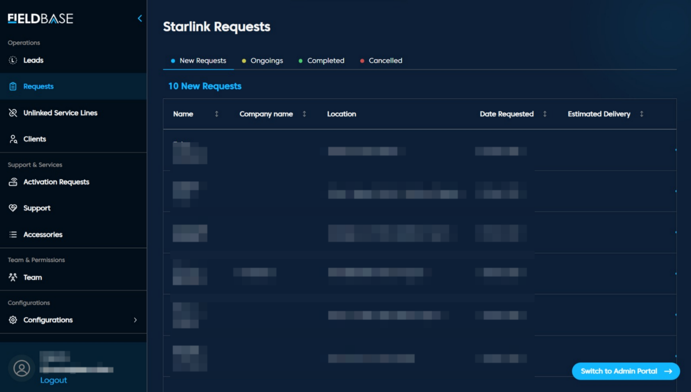

# Dashboard Page

## Overview

The Dashboard serves as a quick access for system wide metrics and activity summaries, including: 
1. Leads Summary
2. Clients Count
3. Team Overview
4. Starlink Requests Statuses
5. Quick Links to Admin Portal

# Starlink Requests

## Tabs

1. **New Requests:** Recently submitted entries, unassigned
2. **Ongoings:** Request being processed
3. **Completed:** Fulfilled installations or service
4. **Cancelled:** Dropped or invalidated requests

**Features**
1. Sort by Date, Company, or Location
2. View Staff Assignments
3. Export request lists
4. Bulk actions for cancelling

## Request Details

| Column               | Description                                       |
|----------------------|---------------------------------------------------|
| Company              | The company or organization linked to the request |
| Location             | Client’s service or installation address          |
| Date Requested       | The date the request was submitted                |
| Estimated Delivery   | Expected date for service delivery                |
| Name                 | Name of the client who submitted the request      |

**Action:** Each row has an **Action Menu** (three dots) on the far right.
This menu provides essential tools for managing individual requests:
- **View Details:** Opens a detailed summary of the client’s request, including status history and contact info.
- **Initiate Job:** Starts the service or installation process. This action moves the request to the **Ongoing** category. 
- **Cancel:** Marks the request as cancelled and removes it from active queues. 
