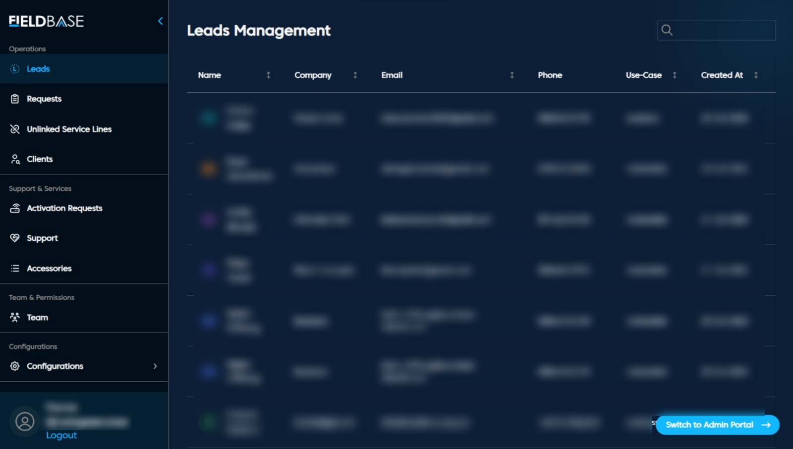

# Leads Management

## Purpose

Manage and track potential clients interested in your services.

## Table Columns

| Field        | Description                          |
|---------------|--------------------------------------|
| Name          | Full name of the lead                |
| Company       | Lead's affiliated organization       |
| Email         | Contact email                        |
| Phone         | Contact number                       |
| Use-Case      | Business or residential need         |
| Created At    | Submission date of the lead          |

**Key Features**

1. Add, filter, and search leads
2. Export or sort data
3. Action Menu: View, convert, or remove leads.

**Action Menu:**
Each lead row has an **Action Menu** (three dots) on the far-right side.  
The menu provides context-specific operations for managing individual leads.
- **View Details:** Opens a detailed lead profile, including contact info, notes, and activity logs. 
- **Convert to Request:** Instantly transform a lead into a Starlink or service request, moving it to the **Requests Page**.
- **Delete Lead:** Removes invalid or duplicate entries from the list.