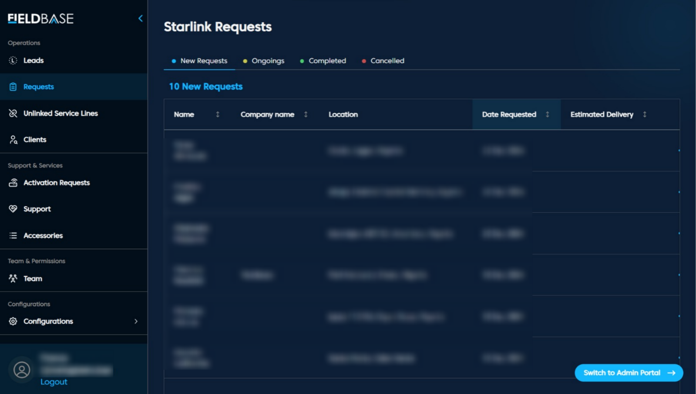

# Starlink Requests 

## Tabs

1. **New Requests:** Recently submitted entries, unassigned
2. **Ongoings:** Request being processed
3. **Completed:** Fulfilled installations or service
4. **Cancelled:** Dropped or invalidated requests
5. **Archived:** Historical records, not actively managed

**Features**
1. Sort by Date, Company, or Location
2. View Staff Assignments
3. Export request lists
4. Bulk actions for archiving or cancelling

