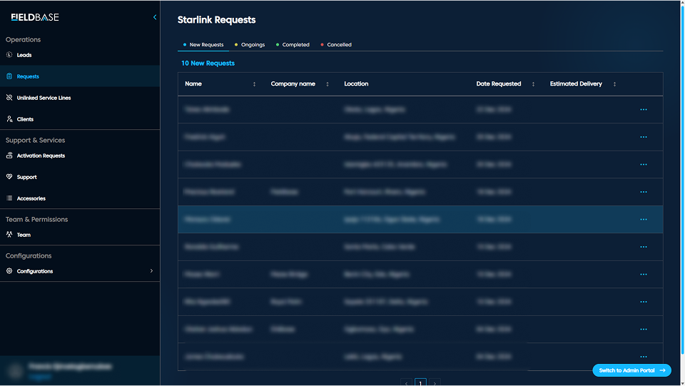

# Dashboard Page

## Overview

The Dashboard serves as a quick access for system wide metrics and activity summaries, including: 
1. Leads Summary
2. Clients Count
3. Team Overview
4. Starlink Requests Statuses
5. Quick Links to Admin Portal

# Starlink Requests

## Tabs

1. **New Requests:** Recently submitted entries, unassigned
2. **Ongoings:** Request being processed
3. **Completed:** Fulfilled installations or service
4. **Cancelled:** Dropped or invalidated requests

**Features**
1. Sort by Date, Company, or Location
2. View Staff Assignments
3. Export request lists
4. Bulk actions for cancelling

## Request Details

| Column               | Description                          |
|----------------------|--------------------------------------|
|  Name                | The full name of the lead.           | 
| Company              | Organizing submitting request        |
| Location             | Address or region of requester       |
| Date Requested       | When the request was made            |
| Estimated Delivery   | Delivery target date                 |

 **Action:** Click on a request to view or assign staff.