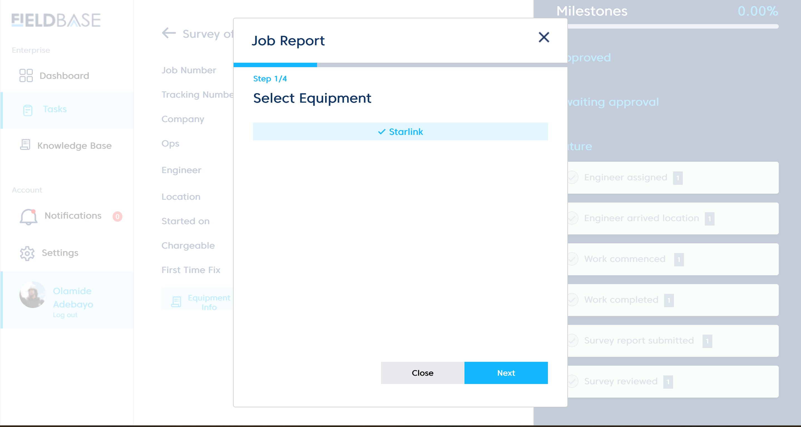
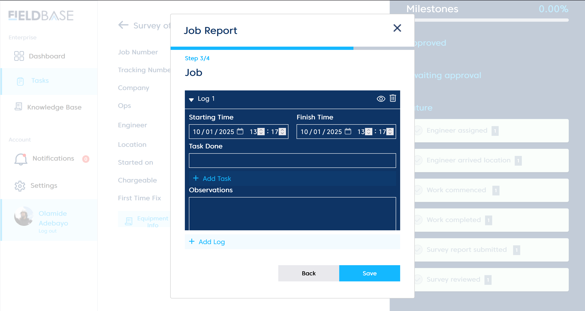
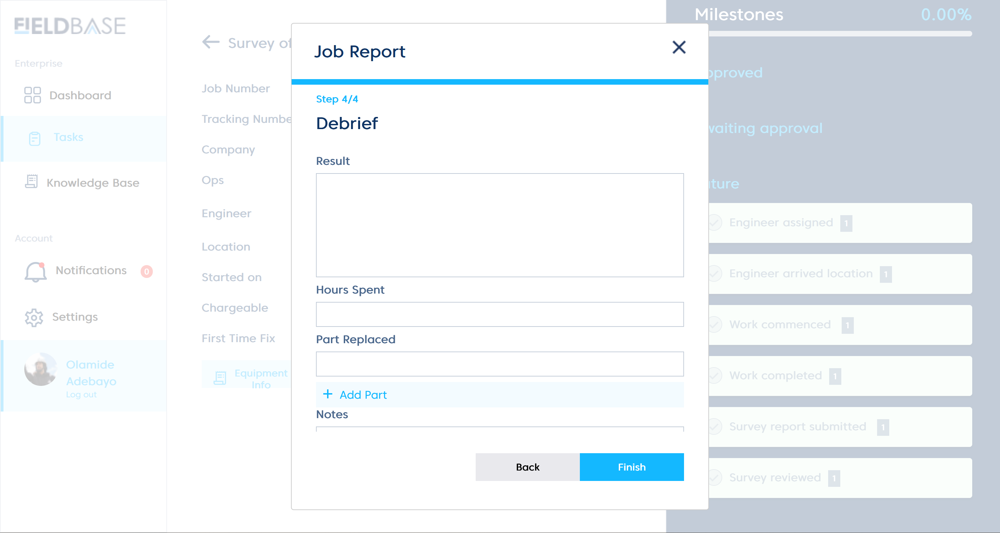
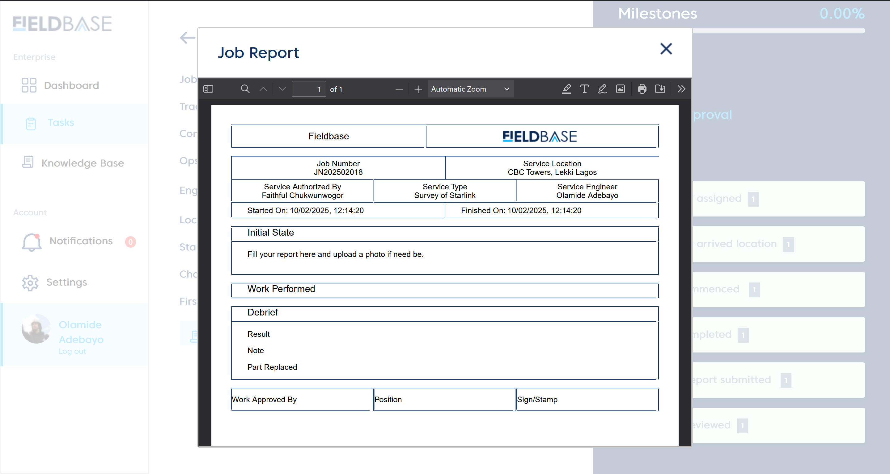
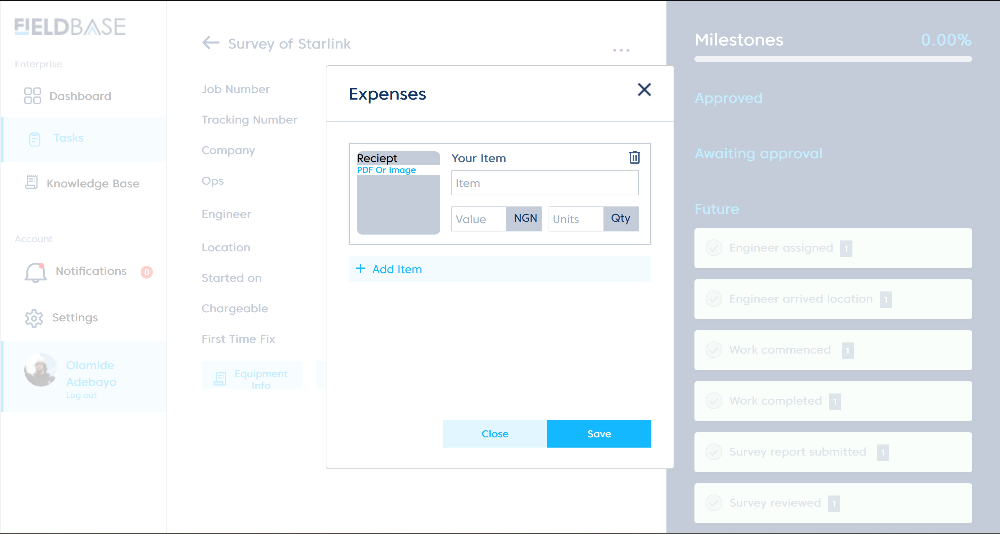

# Executing a task
 

 ## Equipment Information
 This shows the equipment utilised by the assigned engineer, entailing : **equipment name**, **model**, **manufacture** and **job type**

 

  ## Create Report
  To create a report you must follow four steps:

  # Step 1:
   

   Select equipment used for the job (starlink, etc...).

  # Step 2:
   

   1. Fill a **report** in the field provided.
   2. Upload a photo if necessary using the **upload photo button**

  # Step 3:
   

   Log(s) serve as drafts for detailing job reports entailing: **starting time, finish time, task done, and observations.**
   1. set your starting time and finish time.
   2. input task executed inside the input field labelled **task done.**
   3. detail your observations while undergoing task in the input field labelled **observations.**
   4. click the **save button** to save your log(s).

    :::note
    multiple logs can be created for various tasks executed by implementing the **add log button.**
    :::

  # Step 4:
   

   Debrief is the summarisation of the job done entailing:
   1. **Result.**
   2. **Hours spent.**
   3. **Part Replaced.**
   4. **Notes: anything of significance to the debrief been created.**

   ## Report
   

   This is the official template for job report after successfully executing the steps in creating a report.

   ## Expense Report
   

   The expense report tab is for any expense(s) incurred by the engineer, this is to take in details on what item was purchased in relation to job done or ongoing.

   1. Upload your receipt for the expenses inccured (either pdf or image)
   2. State item bought in the **item field**
   3. Value of item in **Naira**
   4. Quantity of item purchased in **units**

   :::note
   If expenses of varying items were incurred use the **Add item**
   :::