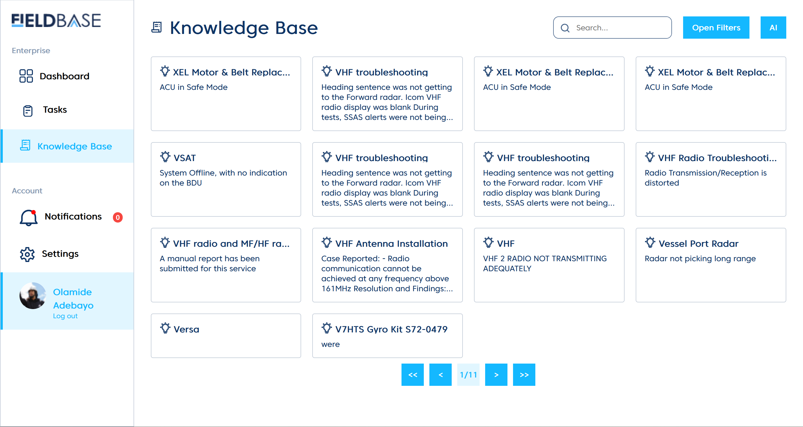
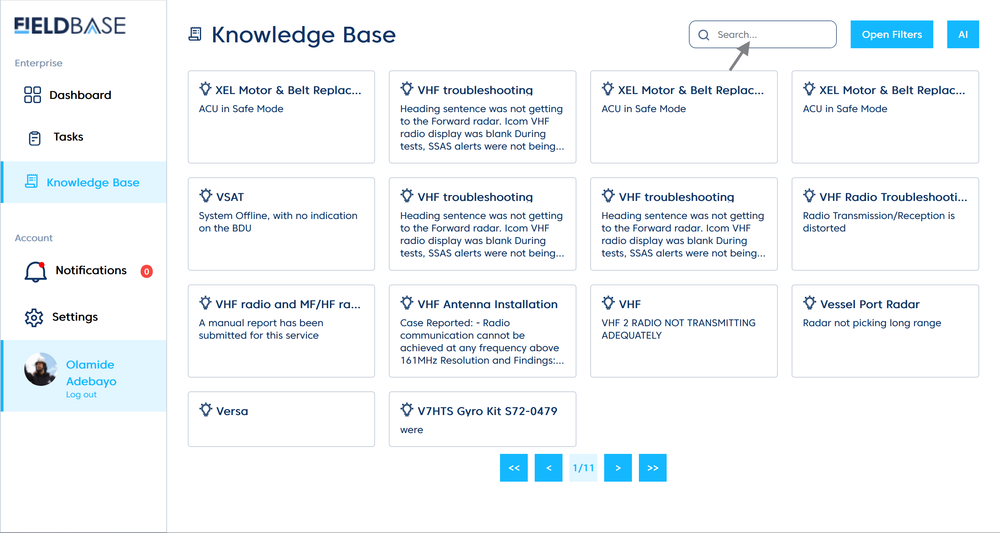
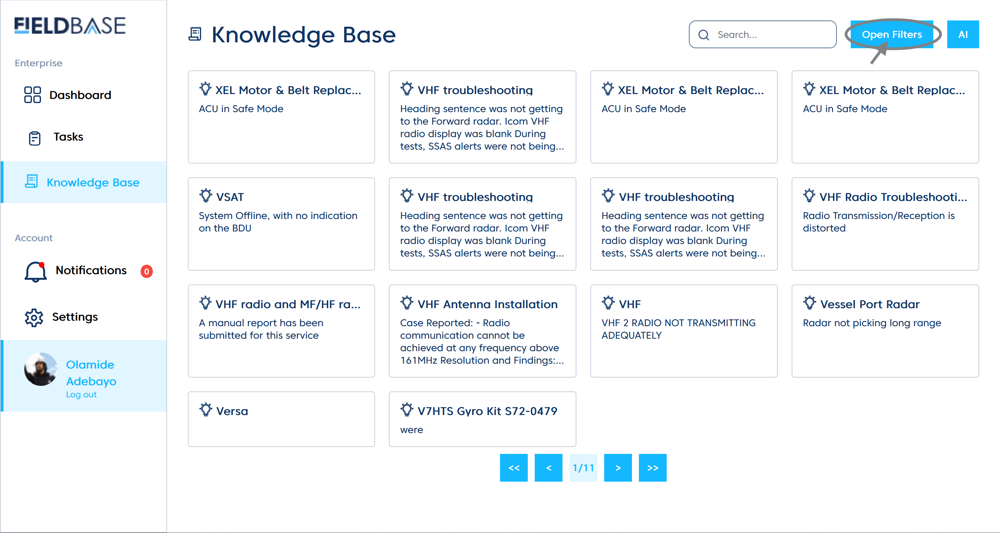
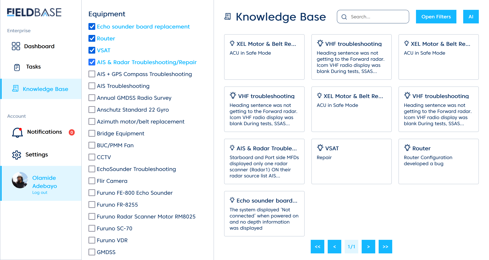
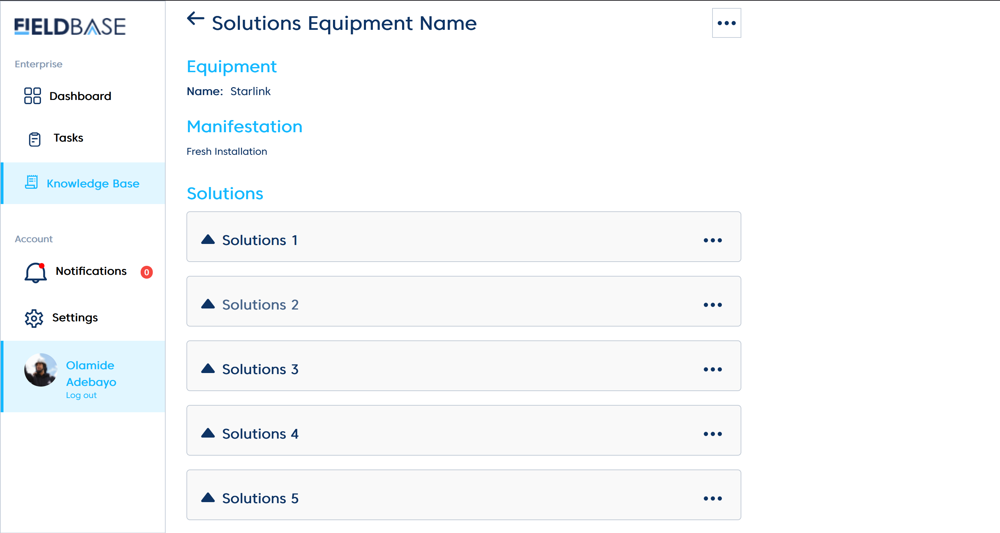
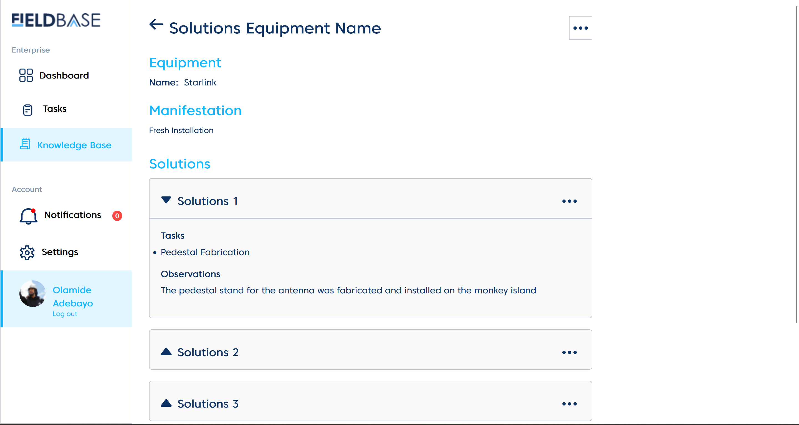
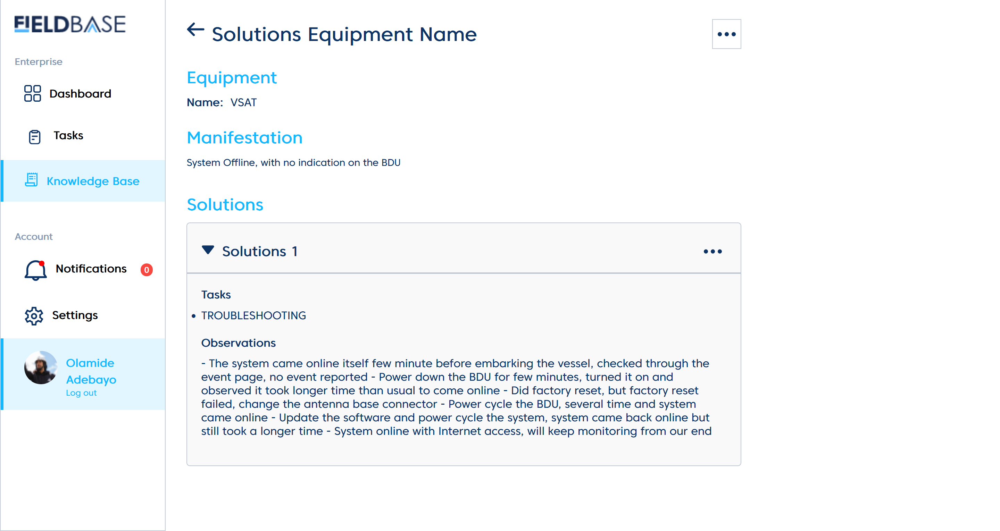

# Knowledge Base

The **knowledge base** feature is used to document equipment-related issues and their corresponding solutions. Engineers will find this tool invaluable for optimizing efficiency and improving job execution.

## Search and Open Filter feature

The **search feature**  is used to look for the equipment in relation to the task.

The **open filter** is a tool that allows the engineer to narrow down or refine the equipment-related information based on the engineer preference.

**Implementing the open filter feature**

# Solutions Equipment Name Tab

This shows the detail of an **equipment-related solution** detailing:

1. Equipment name
2. Manifestation (summary of issue)
3. Solution(s) to the manifestation

## Solution Details

The solution drop down menu details entails:

1. **Tasks**
2. **Observations**

