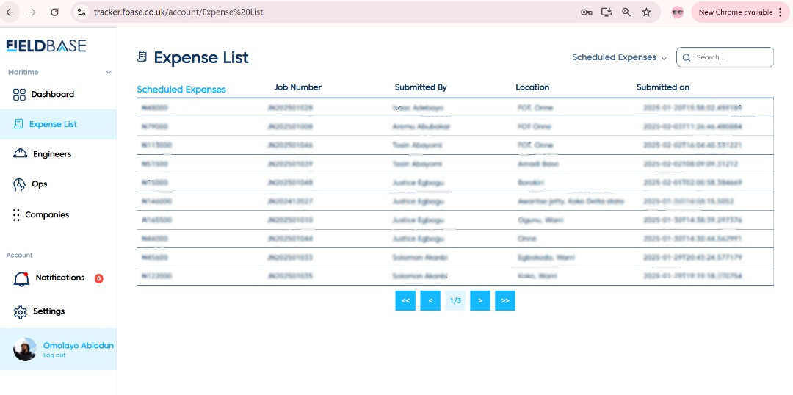

# Expense Approval (Account)

The following steps demonstrates the expense approval done by the **accounting department**:

# Navigate to Expenses

You can toggle between expenses:
- **View list of scheduled expenses.**
- **View list of  pending expenses.**

# Details of an Expense

An expense tab entails the following details above, can examine and either **approve** or **disapprove.**

# Payment Remark

The remark modal appears after either selecting **approve or disapprove.**

# Approved and Disapproved Expense

The views for **approved** and **disapproved** expense with their corresponding list are shown below

