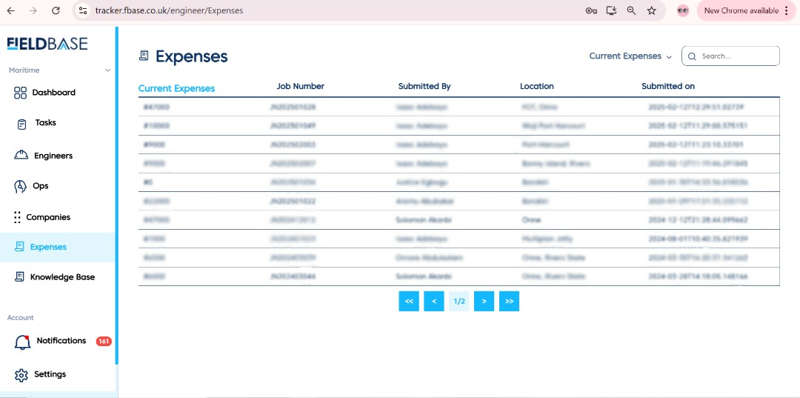
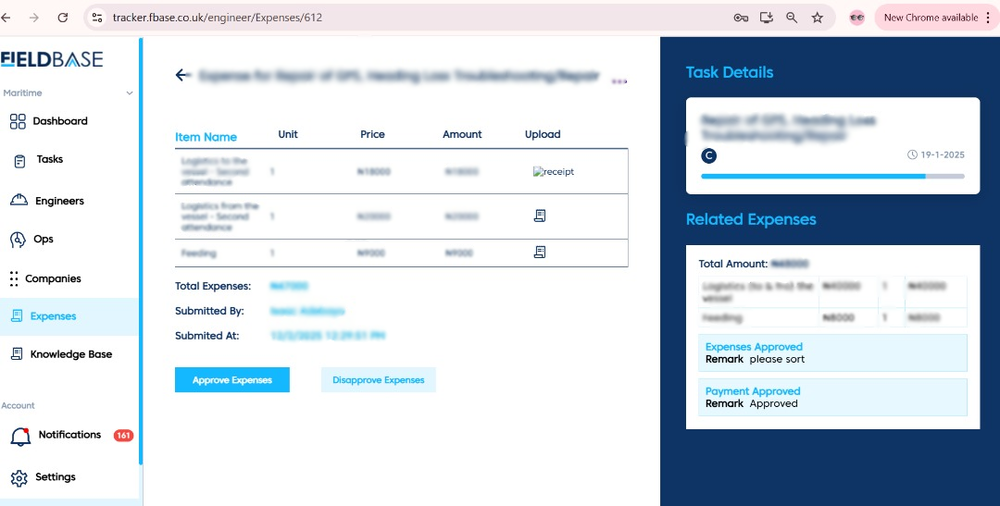
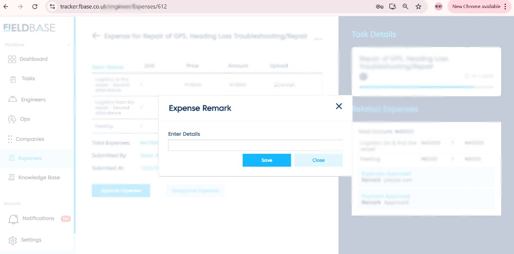
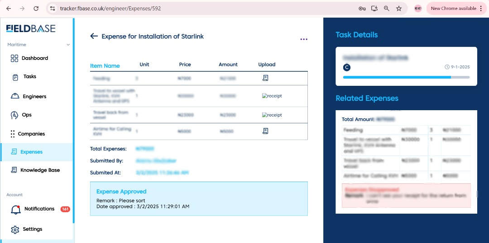
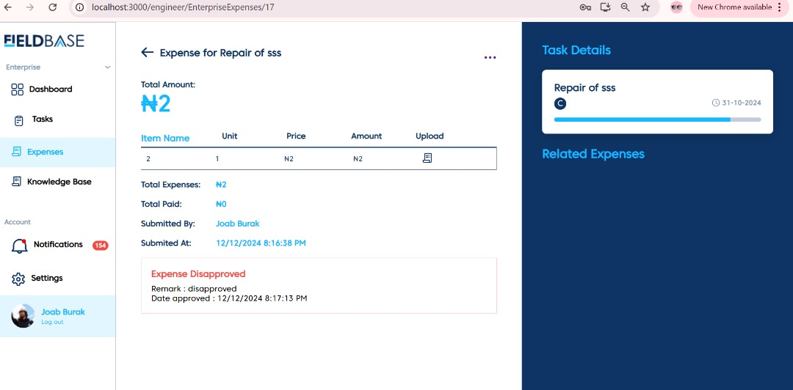

# Expense Approval (Lead Engineer)

The **expense approval** can be initiated by the lead engineer and the accounting department.

The following steps demonstrates the expense approval done by the **lead engineer**:

## Navigate to Expenses

You can toggle between expenses:
- **View list of current expenses.**
- **View list of previous expenses.**

## Details of an Expense

An expense tab entails the following details above, an assigned engineer can examine and either **approve** or **disapprove.**

#p# Expense Remark

The remark modal appears after either selecting **approve or disapprove.**

# Approved and Disapproved Expense

The views for **approved** and **disapproved** expense are shown below

