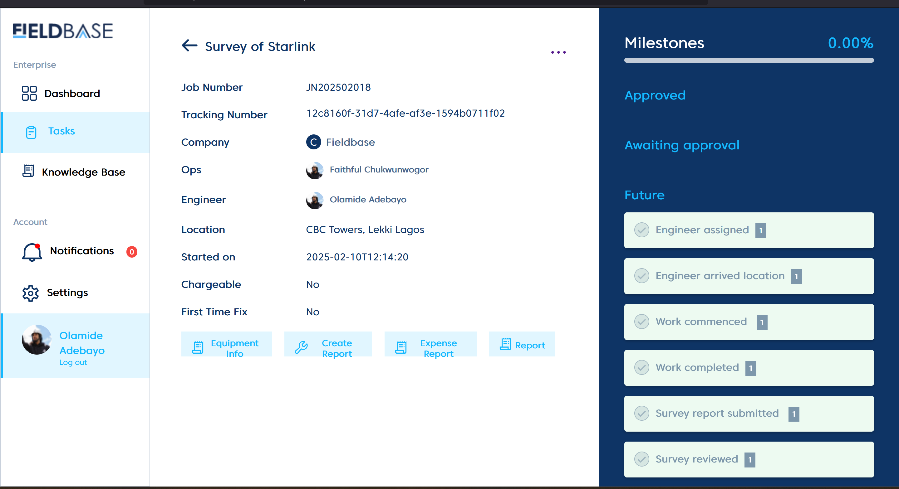
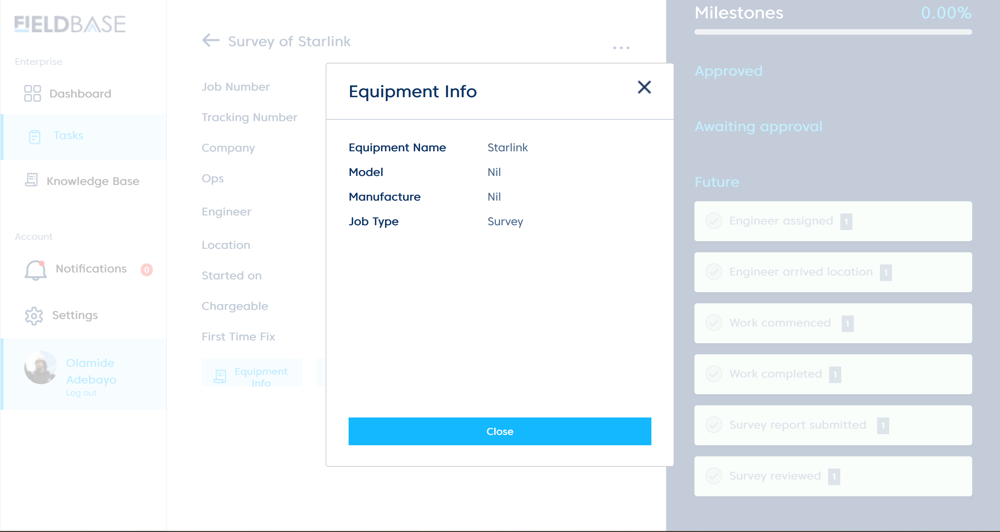
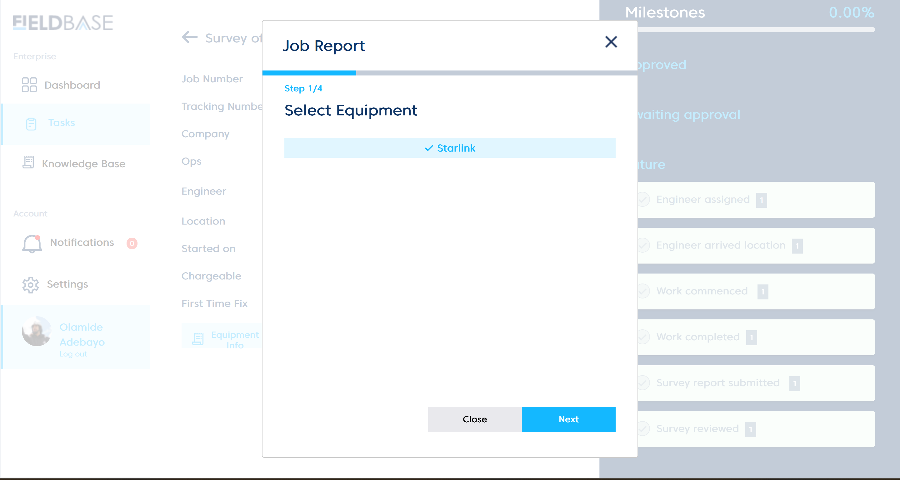
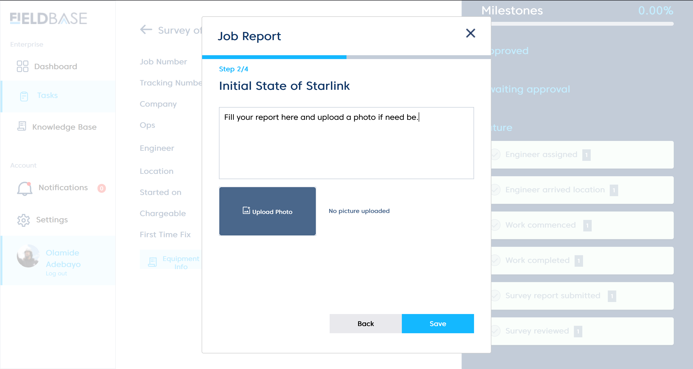
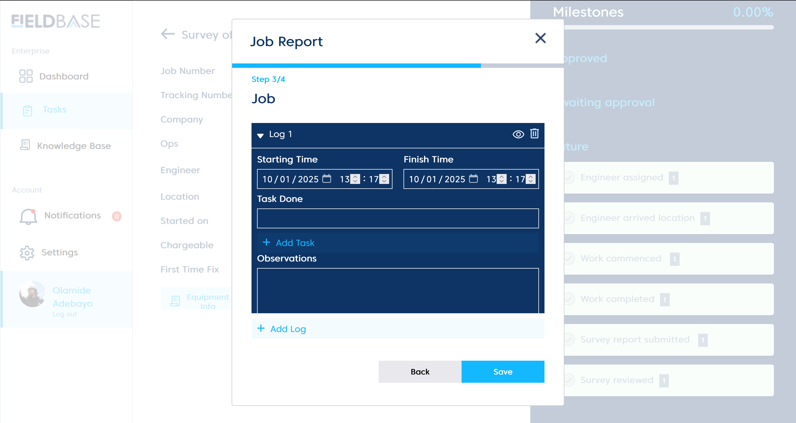
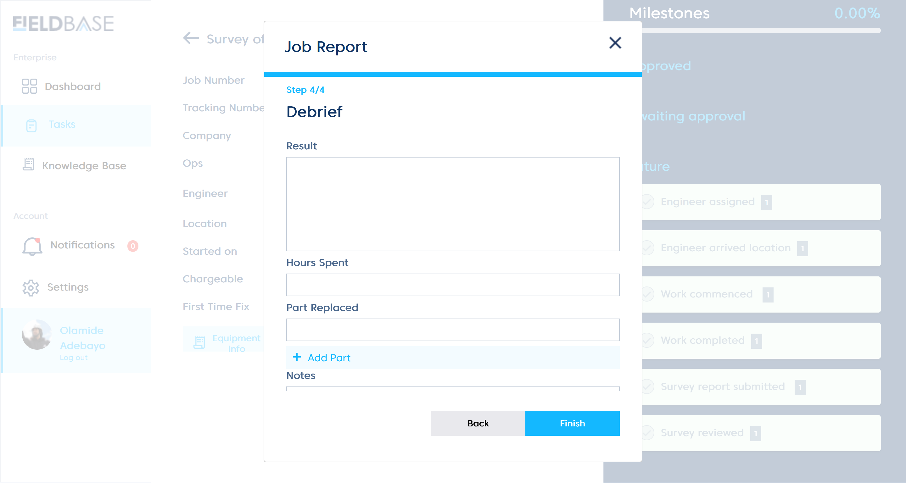
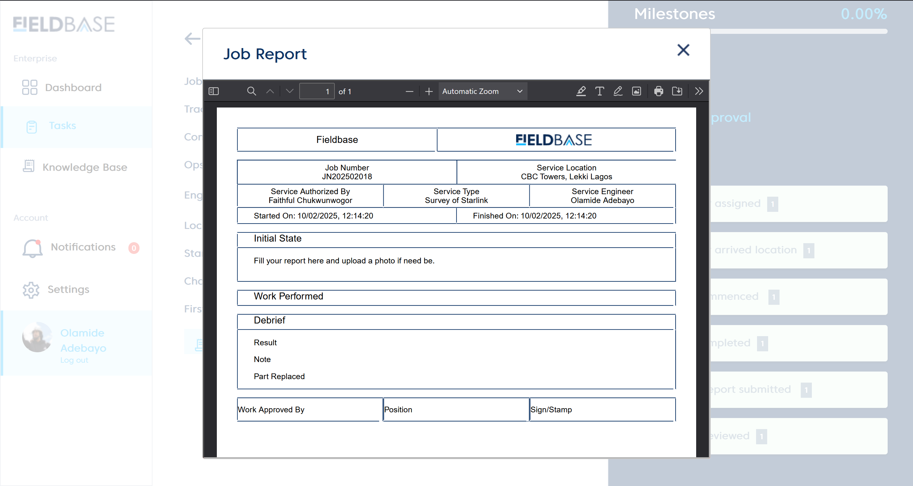

# Executing a task
 

 # Equipment Information
 
 
 This shows the equipment utilised by the assigned engineer.

  # Create Report
  To create a report you must follow four steps:

  # Step 1:
   

   Select equipment used for the job.

  # Step 2:
   

   Fill a report and upload a photo if need be.

  # Step 3:
   

   Log(s) serve as drafts for detailing job reports entailing: starting time, finish time, task done, and observations.

  # Step 4:
   

   Debrief is the summarisation of task job done.

   # Report
   

   This is the official template for job report detailing the steps executed above.